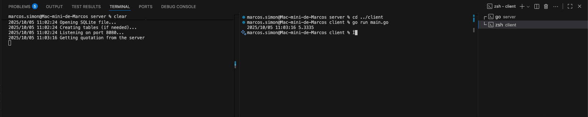

# goexpert-desafio-http-api

Este projeto é uma solução para o desafio técnico Client-Server-API da Pós Go Expert (Full Cycle). Ele é composto por duas aplicações:

## Server

- Responsável por consultar a cotação do dólar em tempo real utilizando a [Awesome API](https://awesomeapi.com.br) e armazenar o valor em um banco de dados local.
- Expõe o endpoint `/cotacao`, que retorna a cotação atual do dólar.
- Para rodar o servidor:
  1. Crie um arquivo `.env` na raiz do projeto e adicione sua chave de API da Awesome API. Sem a chave, você pode receber o erro `429 - too many requests`.
  2. Execute o comando:
     ```
     cd server
     go run main.go
     ```
  3. O servidor estará disponível na porta `8080`.

## Client

- Realiza requisições ao servidor para obter a cotação do dólar.
- Exibe a cotação no terminal e salva o valor em um arquivo `.txt`.
- Para rodar o client, execute:
  ```
  cd client
  go run main.go
  ```

## Requisitos

- Go 1.18 ou superior instalado.
- Chave de API válida da [Awesome API](https://awesomeapi.com.br).

## Observações

- Certifique-se de que o servidor esteja rodando antes de executar o client.
- O projeto segue as boas práticas de organização e separação de responsabilidades entre client e server.

## Imagem do Projeto Rodando

